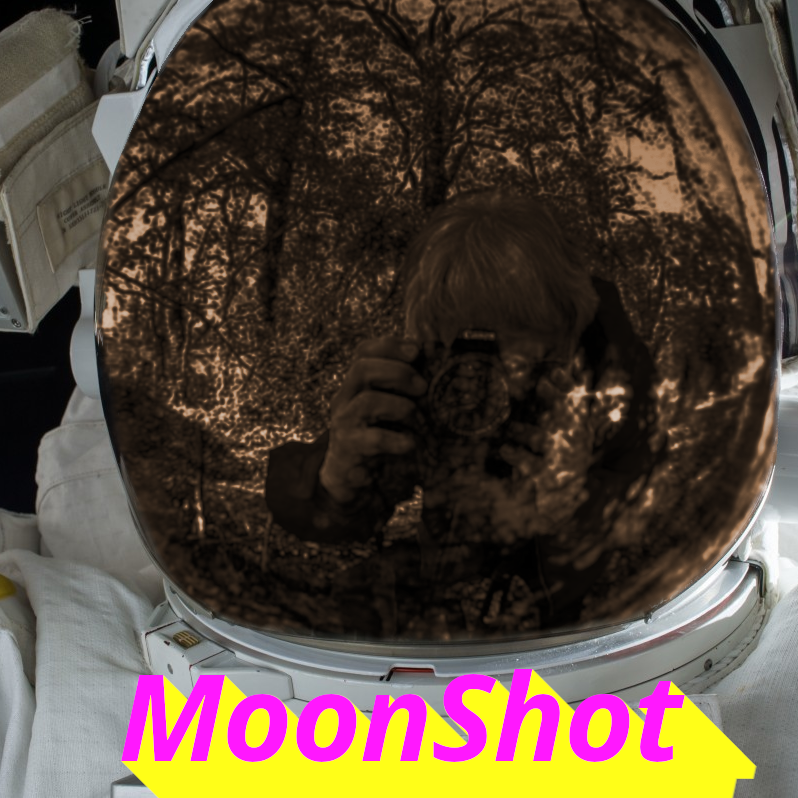

# MoonShot

A work of interactive fiction created by Joey & Charity Parrish for the [GitHub
Game Off 2020](https://itch.io/jam/game-off-2020).

Created with [Inform 7](http://inform7.com/).

## Synopsis

You play as a NASA intern in the 1960s, working on the Apollo 11 project.

Everything goes very well, and you have no difficulties at all.  :grin:

## Playing in a browser

To play the official release version, visit
https://cashpipeplusplus.github.io/moonshot/

## Compilation

You can either load the folder MoonShot.inform into the Inform IDE, or you can
build on the command-line.  Either way, you need to install Inform 7 from
http://inform7.com/downloads/ if you don't already have it.

For command-line builds on Linux using Docker, just type `make`.

The HTML output goes to `MoonShot.materials/Release/`.

## Source

The project structure is more or less dictated by Inform 7, so if you are
unfamiliar with Inform, you may find it hard to locate the relevant source
files.

The main story source is in `MoonShot.inform/Source/story.ni`.  It relies on
several extensions, some of which are standard, some of which were installed
into the sources, and some of which were written expressly for this project.
Extensions are like source modules or libraries in Inform, and can be found in
`MoonShot.materials/Extensions/`.  The extensions written explicitly for this
project are all in `MoonShot.materials/Extensions/Joey Parrish/`, and were
mainly used to organize the source code and keep the non-story elements out of
the main source file.

Other assets, including CSS, cover art, and other associated, non-story
content, can all be found in the `MoonShot.materials/` folder.

The final HTML output goes to `MoonShot.materials/Release/`.

## License

This work is licensed under the Creative Commons
Attribution-NonCommercial-NoDerivatives 4.0 license (CC-BY-NC-ND-4.0).

In short, you may use the work under the following terms:

1. Attribution - You must give appropriate credit, provide a link to the
license, and indicate if changes were made. You may do so in any reasonable
manner, but not in any way that suggests the licensor endorses you or your use.

2. Non-Commercial - You may not use the material for commercial purposes.

3. No Derivatives - If you remix, transform, or build upon the material, you
may not distribute the modified material.

4. No additional restrictions - You may not apply legal terms or technological
measures that legally restrict others from doing anything the license permits.

See `LICENSE.md` or https://creativecommons.org/licenses/by-nc-nd/4.0/ for full
license terms.

-----

This repository also includes JavaScript code and Inform7 extensions from
Vorple (https://vorple-if.com/), under MIT and Creative Commons licenses,
respectively.  See `LICENSE.vorple.md` for details.

-----

The HTML version of the game makes use of a font called "KBKinderWrite",
designed by KhrysKreations (Khrys Bosland).  This font was downloaded from
https://www.fontspace.com/kbkinderwrite-font-f15885 and converted to a web font
with https://www.font-converter.net/ .

The full license for KBKinderWrite is listed on the fontspace page and was
copied into `LICENSE.KBKinderWrite.md` on 2020-11-20.

The terms begin with:

> * This font may be used for ANY free/personal use.
> * You may use this font on your personal blog or website; however you must
>   include my button on the site.

There weren't any instructions for including Khrys's button, so here's my best
guess and a link to their page on fontspace:

It took so long to find this font, and it's a perfect fit.  Thank you, Khrys!

## Cover Art

The cover art is based on the following images:
 - Astronaut helmet photo
   - [original link](https://pxhere.com/en/photo/116453)
   - "No Rights Reserved; Free for personal and commercial use"
   - [Creative Commons CC0 license](https://creativecommons.org/share-your-work/public-domain/cc0/)
 - Glass sphere photo
   - [original link](https://www.pickpik.com/photographer-hobby-profession-glass-ball-leisure-leisure-activity-142240)
   - "The images provided by PickPik are free to use for personal and
     commercial projects"
   - [PickPik Terms of Service](https://www.pickpik.com/terms-of-service)
